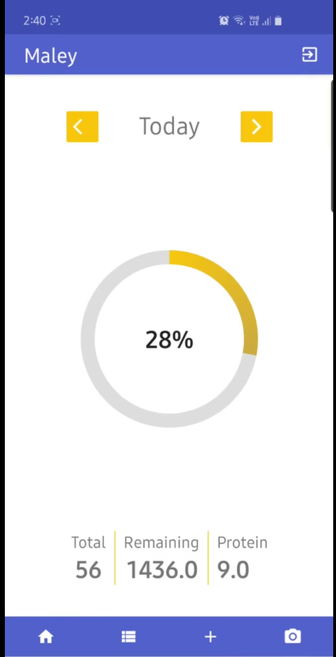

# Maley

‘Maley’ is an android app that identifies the food from images and estimates the nutrient contents from it to track user’s eating habit.

  - Set goals
  - Stay on track
  - Get Visual feedbacks
 
## Demo video

 
[Link to the video](https://drive.google.com/file/d/1AVt7sBuM8clTwf-mr25ERiFUlDRybuQ-/view?usp=sharing)

## Awesome Features!

  - Multiple authentication methods 
  - Uses state-of-the art machine learning service
  - Identifies and categorize more than 2000 food items from images

## System requirements
- compileSdkVersion 28
- minSdkVersion 21
- targetSdkVersion 28

## Dependencies
- Retrofit
- Nutritionix api
- Ibm Watson visual recognition
- Firebase authentication
- Firebase auth ui
- Firebase realtime database

## API keys
To use another api key, replace the api keys in the code itself and build the app and run. 
- Ibm Watson api key
- Nutritionix api key

